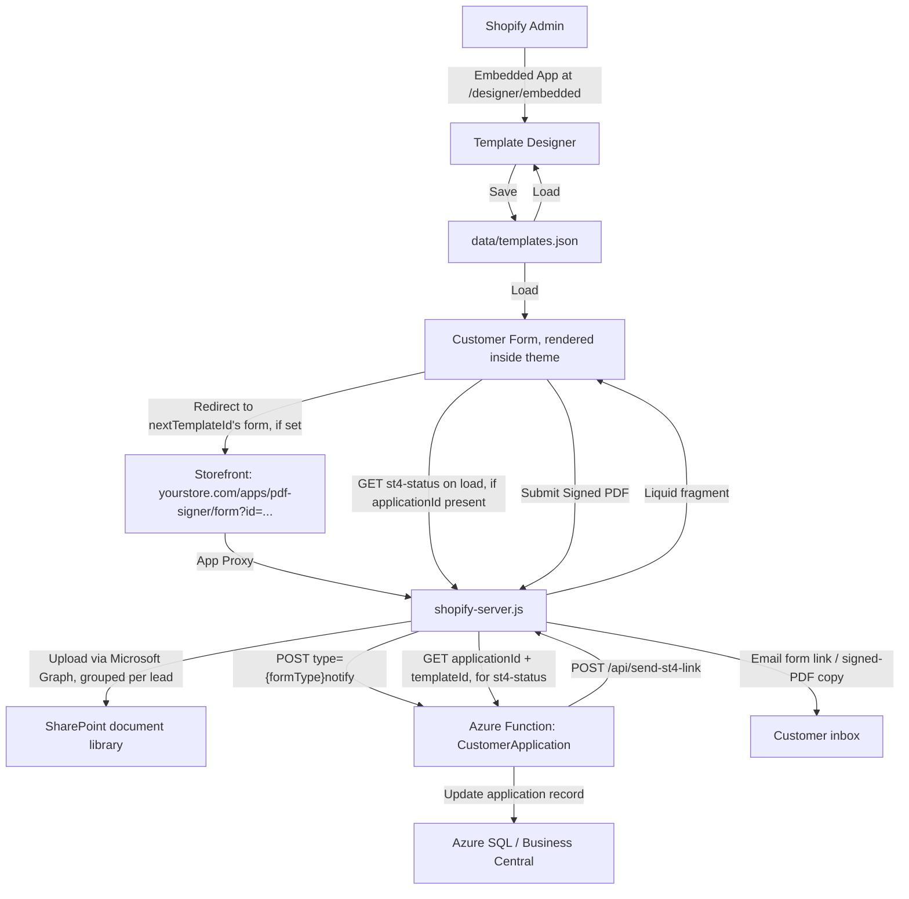

# PDF Signer — Shopify App (Template Designer + Customer Forms)

A Shopify app for building fillable PDF templates and collecting customer
signatures directly on your storefront, embedded in the store's theme (not
an iframe). Signed PDFs are stored in SharePoint.

## What's included

| File | Purpose |
|------|---------|
| `shopify-server.js` | Express backend — API, OAuth, App Proxy, Liquid-fragment rendering |
| `sharepoint.js` | Uploads signed PDFs to a SharePoint document library via Microsoft Graph |
| `email.js` | Emails the customer their signed-PDF copy and their personalised ST-4 form link via Microsoft Graph |
| `graphAuth.js` | Shared Graph client-credentials token fetch used by `sharepoint.js` and `email.js` |
| `public/template-designer.html` | Drag-and-drop PDF template builder (embedded in Shopify Admin) |
| `public/customer-form.html` | Customer-facing fill & sign form (served on your storefront) |
| `data/templates.json` | Local JSON storage for templates (see note below — this is live app data, not a seed file) |
| `data/*.pdf` | Sample/demo PDFs used by the local templates |
| `shopify.app.toml` | Shopify CLI app config — the real, deployed source of truth for App Proxy/OAuth/scopes |
| `legacy/` | Old standalone prototype, unreferenced dead code |
| `scripts/` | One-off dev scripts (demo PDF generation, dev-store page updates) |
| `.env.example` | Environment variable template |

## Quick Start (Local Dev)

```bash
npm install
# Copy .env.example to .env and fill in your Shopify + SharePoint credentials
cp .env.example .env
npm start
```

Then open:
- **Template Designer:** http://localhost:3001/designer
- **Customer Form:** http://localhost:3001/form?id=TEMPLATE_ID

`npm start` also auto-launches a `localtunnel` so the app is reachable at a public URL for Shopify to proxy to during local development (skip it with `DISABLE_TUNNEL=1`).

## How It All Fits Together



There is also an optional round-trip with a separate **Business Central Azure
Function** (its own repo): the function emails customers a personalised form
link through this server (`/api/send-st4-link`), and when a signed PDF comes
back in with an `applicationId`, this server notifies the function
(`type={formType}notify`, e.g. `st4notify` or `page3notify`) to update the BC
application record. A lead can now be routed through **more than one form in
sequence** — a template's optional `nextTemplateId` chains its submission
straight into the next form instead of ending the flow, and its `formType`
tag determines which notify type/columns get updated. Since customers can
reach any given form in the chain twice (an immediate redirect from signup,
and an emailed fallback link), the form also checks
`GET /api/st4-status/:applicationId?templateId=…` on load and shows "already
submitted" instead of a fillable form if that specific form's already been
signed. See `CLAUDE.md`'s "Azure Function round-trip" section for the
two-key auth details and the full chaining mechanism.

The customer form is **not** an iframe. `GET /proxy/form` returns a body
fragment (`Content-Type: application/liquid`) that Shopify merges directly
into the store's theme layout — same header/footer/fonts as the rest of the
site. See `CLAUDE.md` for the mechanics.

## Setting Up the Shopify App

This app is managed with **Shopify CLI**, not the classic Partner Dashboard
click-through flow. `shopify.app.toml` is the real config; edit it and
deploy, don't hand-configure things in a dashboard.

### 1. Create/link the app

```bash
npx shopify app config link --client-id=<your-client-id>
```
This needs a real interactive terminal (org/app selection prompts) — run it
in your own terminal, not through an automation tool that pipes stdin.

If you don't have a `client_id` yet, create the app first from the
[Dev Dashboard](https://dev.shopify.com) or Partner Dashboard, then link it.

**New apps need a Distribution method set once** in the Dev Dashboard before
any install works ("This app can't be installed yet" otherwise) — for a
single-merchant app, choose "Custom distribution." That gives you a signed
install link (`admin.shopify.com/store/{store}/oauth/install_custom_app?...`)
to use for installing on your store.

### 2. Configure `shopify.app.toml`

```toml
name = "PDF Signer & Form Builder"
client_id = "your-client-id"
application_url = "https://your-domain.com/designer/embedded"
embedded = true

[access_scopes]
scopes = "write_files,read_files,write_orders,read_orders,read_themes,write_themes,read_content,write_content"

[auth]
redirect_urls = [ "https://your-domain.com/auth/callback" ]

[webhooks]
api_version = "2024-10"

[app_proxy]
url = "https://your-domain.com/proxy"
subpath = "pdf-signer"
prefix = "apps"
```

This makes the customer form available at:
`https://your-store.myshopify.com/apps/pdf-signer/form?id=TEMPLATE_ID`

Deploy config changes with:
```bash
npx shopify app deploy --client-id=<your-client-id> --allow-updates
```

### 3. Set Environment Variables

```
SHOPIFY_STORE=your-store.myshopify.com
SHOPIFY_CLIENT_SECRET=shpss_xxxxxxxxxxxxxxxxxxxxxxxxxx   # only secret production needs from Shopify
SHOPIFY_CLIENT_ID=your_client_id                          # not secret; only needed to enable /auth install routes
SESSION_SECRET=a-random-secret-string
APP_URL=https://your-domain.com
PORT=3001
REQUIRE_PROXY_SIGNATURE=1   # production: reject unsigned App Proxy requests
```

No `SHOPIFY_ADMIN_API_TOKEN` is required — this app no longer talks to the
Shopify Admin API for anything on the customer-signing path (signed PDFs go
to SharePoint, not Shopify Files).

Microsoft Graph / SharePoint (see `sharepoint.js` for the full option list):
```
MS_TENANT_ID=...
MS_CLIENT_ID=...
MS_CLIENT_SECRET=...
SHAREPOINT_DRIVE_ID=...        # or SHAREPOINT_HOSTNAME + SHAREPOINT_SITE_PATH
SHAREPOINT_FOLDER=...          # optional subfolder within the library
```

Customer emails (separate Entra app registration from `MS_*` — see `.env.example`):
```
MAIL_TENANT_ID=...
MAIL_CLIENT_ID=...
MAIL_CLIENT_SECRET=...
MAIL_FROM=...                  # must be a licensed Exchange Online mailbox
```

Business Central notification (optional — only if using the Azure Function integration):
```
AZURE_FUNCTION_URL=...         # full trigger URL INCLUDING ?code=<function key>
AZURE_FUNCTION_API_KEY=...     # must match an entry in the function's API_KEYS setting
```

### 4. Install the App on Your Store

Use the signed custom-distribution install link from step 1 — not a
hand-built `/admin/oauth/authorize` URL, which 401s for Dev Dashboard apps.

## API Endpoints

### Templates
- `GET /api/templates` — List all templates
- `GET /api/templates/:id` — Get single template (includes PDF base64 & fields)
- `POST /api/templates` — Create template
  - Body: `{ name, pdfFileName?, pdfBase64?, fields?, nextTemplateId?, formType? }`
  - `nextTemplateId` (optional): chains this template's customer-form submission into
    another template's form instead of ending the flow — see "Azure Function round-trip"
    in `CLAUDE.md`
  - `formType` (optional): tags which BC notify `type={formType}notify` this template's
    signed PDF reports as; defaults to `st4` when unset
- `PUT /api/templates/:id` — Update template (same optional fields as above)
- `DELETE /api/templates/:id` — Delete template

Each has a `/proxy/api/...` equivalent for App Proxy requests (signature-verified).
Both `nextTemplateId` and `formType` are editable from the Template Designer toolbar.

### Signed PDF
- `POST /api/save-signed-pdf` — Upload a signed PDF to SharePoint
  - Body: `{ filename, pdfBase64, email?, applicationId?, name?, templateId? }`
  - `email` (optional): the customer also gets a copy of the signed PDF by email
  - `name` (optional): used to group this lead's SharePoint files into a per-lead folder
    (with `applicationId`) instead of the flat library root
  - `templateId` (optional): resolves the submitted template's `formType`, used to notify
    with the correct type below; defaults to `st4` if omitted
  - `applicationId` (optional): the server notifies the Business Central Azure Function
    (`type={formType}notify`, e.g. `st4notify`/`page3notify`) so the application record is
    updated with the signed-PDF URL
  - `/proxy/api/save-signed-pdf` is the App Proxy equivalent

### ST-4 form link email
- `POST /api/send-st4-link` — Email a customer their personalised form link
  - Body: `{ email, customerName?, applicationId, templateId }`
  - Server-to-server only (called by the Business Central Azure Function after an
    application is submitted); no App Proxy equivalent
  - The link embeds `email` and `applicationId` so the eventual submission closes
    the loop back to BC — see `CLAUDE.md`'s "Azure Function round-trip" section

### Form submission status
- `GET /api/st4-status/:applicationId?templateId=` — Check whether an application's
  form has already been signed and submitted
  - `templateId` (optional query param): resolves which form type to check (via the
    template's `formType`) — omitted or unrecognized falls back to `st4`, so existing
    callers are unaffected
  - Response: `{ submitted: boolean, status: string|null, checkedOk: boolean }`
  - Used by `customer-form.html` on load to detect the case where a customer
    reaches a given form twice (immediate redirect + `send-st4-link` fallback
    email both land there) and show an "already submitted" message instead of
    a fillable form a second time
  - Best-effort/fail-open: `checkedOk: false` means the check itself couldn't be
    confirmed (e.g. the Azure Function's SQL backend is cold-starting) — treated
    as "not submitted" so a slow check never blocks a legitimate signer
  - `/proxy/api/st4-status/:applicationId` is the App Proxy equivalent

### OAuth (only needed if you install via `/auth` instead of the custom-distribution link)
- `GET /auth?shop=STORE` — Initiate Shopify OAuth install
- `GET /auth/callback` — OAuth callback (Shopify redirects here)

### Storefront (App Proxy)
- `GET /proxy/form?id=TEMPLATE_ID` — Customer form, returned as a Liquid fragment for theme embedding
- `GET /proxy/api/templates/:id` — Template data (proxied)
- `POST /proxy/api/save-signed-pdf` — Save signed PDF (proxied)
- `GET /proxy/api/st4-status/:applicationId` — ST-4 submission status check (proxied)

## Deploying

The maintained deploy target is **Azure App Service** (Linux, Node). See
`CLAUDE.md` for the full deploy procedure, including a critical step:
**sync `data/templates.json` from the live app before every deploy** — the
deploy package includes whatever's in that file locally, and merchants edit
templates live through the Designer, so deploying a stale copy silently
overwrites their work.

```bash
az webapp deploy --name <app-name> --resource-group <rg> --src-path <zip> --type zip
```

The zip must be source-only (no `node_modules`) — remote build
(`SCM_DO_BUILD_DURING_DEPLOYMENT=true`) installs dependencies server-side.
Build the zip with Python's `zipfile` module rather than PowerShell's
`Compress-Archive`, which writes backslash path separators that break
anything parsing the archive's directory structure.

`render.yaml` (Render), `fly.toml` + `Dockerfile` (Fly.io), and `Procfile`
(Heroku-style) are also checked in but unverified since the move to Azure —
they'd need testing before relying on them.

## Notes
- Templates are stored in `data/templates.json` — this is live production data on the deployed app, not just a local seed file, and it's currently the only storage layer (no database). Production should eventually swap this for a real DB; see `CLAUDE.md`'s "Template storage" section before changing anything here in the meantime.
- A customer's flow can now span more than one template — see `nextTemplateId` above. There's no cap on chain length, but only two templates exist today: a "Customer Application — Page 3" form chaining into the ST-4 form.
- The template designer works standalone (direct access) and embedded in Shopify Admin.
- The customer form auto-detects whether it's served via App Proxy or directly, and works as a theme-embedded page (not an iframe) when proxied.
- `pdf-lib` writes text/signature/checkbox marks directly into the original PDF in the browser — the server never touches PDF bytes except to relay them to SharePoint. A separate devDependency copy of `pdf-lib` also exists purely for the one-off `scripts/extract_page3.js`; see `CLAUDE.md`.
- Customers can also download a filled copy of the PDF directly (no submission required) via the "Download PDF" button.
- Signed PDFs are grouped into per-lead SharePoint subfolders (named from the customer's name + applicationId) when both are available; see `CLAUDE.md`'s "PDF handling" section.
