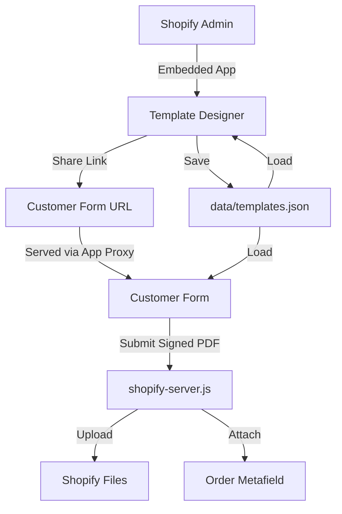

# PDF Signer — Shopify App (Template Designer + Customer Forms)

A complete Shopify embedded app for building fillable PDF templates and
collecting customer signatures directly on your storefront.

## What's included

| File | Purpose |
|------|---------|
| `shopify-server.js` | Express backend — API, OAuth, App Proxy, Shopify uploads |
| `public/template-designer.html` | Drag-and-drop PDF template builder (embedded in Shopify Admin) |
| `public/customer-form.html` | Customer-facing fill & sign form (served on your storefront) |
| `data/templates.json` | Local JSON storage for templates |
| `data/*.pdf` | Sample/demo PDFs used by the local templates |
| `legacy/pdf-signer.html` | Older standalone prototype, still served at `/` |
| `scripts/` | One-off dev scripts (demo PDF generation, dev-store page updates) |
| `shopify.app.toml` | Shopify app configuration reference |
| `.env.example` | Environment variable template |

## Quick Start (Local Dev)

```bash
npm install
# Copy .env.example to .env and fill in your Shopify credentials
cp .env.example .env
npm start
```

Then open:
- **Template Designer:** http://localhost:3001/designer
- **Customer Form:** http://localhost:3001/form?id=TEMPLATE_ID

## Connecting to Shopify as an Embedded App

### 1. Create a Shopify App in Partner Dashboard

1. Go to [Shopify Partners](https://partners.shopify.com/) → Apps → Create app
2. Choose **"Build custom app"** or **"Public app"**
3. Under **Configuration**, set:
   - **App URL:** `https://your-domain.com/designer/embedded`
   - **Allowed redirection URLs:** `https://your-domain.com/auth/callback`

### 2. Configure App Proxy (for customer form on storefront)

In the Partner Dashboard, under **App setup** → **App proxy**:
- **Subpath prefix:** `apps`
- **Subpath:** `pdf-signer`
- **Proxy URL:** `https://your-domain.com/proxy`

This makes the customer form available at:
`https://your-store.myshopify.com/apps/pdf-signer/form?id=TEMPLATE_ID`

### 3. Set Environment Variables

```
SHOPIFY_STORE=yog-dev-store.myshopify.com
SHOPIFY_CLIENT_ID=your_client_id
SHOPIFY_CLIENT_SECRET=your_client_secret
PORT=3001
APP_URL=https://your-domain.com       # Your deployed URL
SESSION_SECRET=a-random-secret-string
```

Alternatively, use a direct Admin API token (simpler for testing):
```
SHOPIFY_ADMIN_API_TOKEN=shpat_xxxxxxxxxxxxxxxxxxxxxxxxxx
```

### 4. Required API Scopes

- `write_files`, `read_files` — Upload signed PDFs to Shopify Files
- `write_orders`, `read_orders` — Attach PDFs to orders via metafields
- `read_themes`, `write_themes` — For theme app extensions (optional)
- `read_content`, `write_content` — Read/write Shopify pages via API (needed for storefront iframe updates)

### 5. Install the App on Your Store

```
https://your-domain.com/auth?shop=your-store.myshopify.com
```

After OAuth approval, the Template Designer will appear in your Shopify Admin
under **Apps** → **PDF Signer & Form Builder**.

## How It All Fits Together



## API Endpoints

### Templates
- `GET /api/templates` — List all templates
- `GET /api/templates/:id` — Get single template (includes PDF base64 & fields)
- `POST /api/templates` — Create template
- `PUT /api/templates/:id` — Update template
- `DELETE /api/templates/:id` — Delete template

### Shopify Upload
- `POST /api/save-signed-pdf` — Upload signed PDF to Shopify Files
  - Body: `{ filename, pdfBase64, shopifyOrderId? }`

### OAuth
- `GET /auth?shop=STORE` — Initiate Shopify OAuth install
- `GET /auth/callback` — OAuth callback (Shopify redirects here)

### App Proxy (Storefront)
- `GET /proxy/form?id=TEMPLATE_ID` — Customer form (proxied from store domain)
- `GET /proxy/api/templates/:id` — Template data (proxied)
- `POST /proxy/api/save-signed-pdf` — Save signed PDF (proxied)

## Deploying

### Option 1: Render (Recommended — Easiest)

1. Push this repo to GitHub
2. Go to [render.com](https://render.com) → **New +** → **Blueprint**
3. Connect your GitHub repo — Render auto-detects `render.yaml`
4. Set these **Environment Variables** in the Render dashboard:
   - `SHOPIFY_STORE` — e.g. `yog-dev-store.myshopify.com`
   - `SHOPIFY_ADMIN_API_TOKEN` — your admin token
   - `SHOPIFY_CLIENT_ID` — from Partner Dashboard
   - `SHOPIFY_CLIENT_SECRET` — from Partner Dashboard
   - `APP_URL` — your Render URL (e.g. `https://shopify-pdf-signer.onrender.com`)
   - `SESSION_SECRET` — auto-generated by Render
5. Click **Apply** — Render builds and deploys automatically
6. Update your Shopify App URLs and App Proxy to point to your Render URL

### Option 2: Fly.io

```bash
fly launch                          # Already configured via fly.toml
fly secrets set SHOPIFY_STORE=...   # Set all secrets via fly CLI
fly deploy
```

### Option 3: Docker

```bash
docker build -t shopify-pdf-signer .
docker run -p 3001:3001 --env-file .env shopify-pdf-signer
```

### After Deploying — Update Shopify Configuration

1. **App URL:** `https://your-domain.com/designer/embedded`
2. **Redirect URLs:** Add `https://your-domain.com/auth/callback`
3. **App Proxy URL:** `https://your-domain.com/proxy`
4. **Storefront iframe:** Update your Shopify page to use `https://your-domain.com/form?id=TEMPLATE_ID`

### Regenerating Your Admin Token (if scopes changed)

If you added new API scopes (like `read_content`/`write_content`), your existing
admin token won't have them. To regenerate:

1. Go to [Shopify Partners](https://partners.shopify.com/) → **Apps** → **Your App** → **API Access**
2. Under **Admin API access token**, click **Regenerate** or **Create token**
3. Select the updated scopes (including `read_content` and `write_content`)
4. Copy the new token and update `SHOPIFY_ADMIN_API_TOKEN` in your `.env` / Render env vars

## Notes
- Templates are stored locally in `data/templates.json`. For production, switch to a database.
- The template designer works standalone (direct access) and embedded in Shopify Admin.
- The customer form auto-detects whether it's served via App Proxy or directly.
- `pdf-lib` writes text/signature directly into the original PDF, preserving quality.
